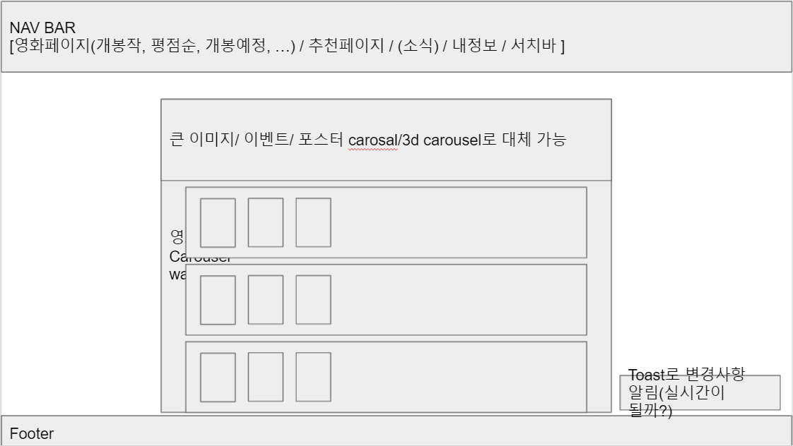

# 1학기 파이널 프로젝트


# 

## 프로젝트 구조

```
모바일 대응을 위한 반응형 웹 Django REST API 서버 및 프론트엔드 프레임워크 Vue.js) 분리 등의 상세 구현 방식은 자유롭게 구성하되 프로젝트 README.md 상단에 프로젝트 구조에 대한 설명을 반드시 명시해야 합니다
```


```
$ cmd //c tree //a //f
폴더 PATH의 목록입니다.
볼륨 일련 번호는 0EE8-1F09입니다.
C:.
|   .gitignore
|   README.md
|   README.pdf
|
+---final-pjt-back
|   |   db.sqlite3
|   |   manage.py
|   |   requirements.txt
|   |   
|   +---accounts
|   |   |   admin.py
|   |   |   apps.py
|   |   |   forms.py
|   |   |   models.py
|   |   |   serializers.py
|   |   |   tests.py
|   |   |   urls.py
|   |   |   views.py
|   |   |   __init__.py
|   |   |
|   |   +---migrations
|   |   |   |   0001_initial.py
|   |   |   |   0002_initial.py
|   |   |   |   __init__.py
|   |   |
|   |   +---templates
|   |   |   \---accounts
|   |   |           login.html
|   |   |           profile.html
|   |   |           signup.html
|   |   |           _follow.html
|   | 
|   |
|   +---community
|   |   |   admin.py
|   |   |   apps.py
|   |   |   forms.py
|   |   |   models.py
|   |   |   serializers.py
|   |   |   tests.py
|   |   |   urls.py
|   |   |   views.py
|   |   |   __init__.py
|   |   |
|   |   +---migrations
|   |   |   |   0001_initial.py
|   |   |   |   __init__.py
|   |   |   |
|   |   |
|   |   +---templates
|   |   |   \---community
|   |   |           create.html
|   |   |           detail.html
|   |   |           index.html
|   | 
|   |
|   +---movies
|   |   |   admin.py
|   |   |   apps.py
|   |   |   forms.py
|   |   |   models.py
|   |   |   serializers.py
|   |   |   tests.py
|   |   |   urls.py
|   |   |   views.py
|   |   |   __init__.py
|   |   |
|   |   +---fixtures
|   |   |       movies.json
|   |   |       
|   |   +---migrations
|   |   |   |   0001_initial.py
|   |   |   |   __init__.py
|   |   |  
|   |   |
|   |   +---templates
|   |   |   \---movies
|   |   |           detail.html
|   |   |           index.html
|   |   |           recommended.html
|   |  
|   +---pjt09
|   |   |   asgi.py
|   |   |   settings.py
|   |   |   urls.py
|   |   |   wsgi.py
|   |   |   __init__.py
|   |   
|   |
|   \---templates
|           base.html
|
+---final-pjt-front
|   |   .gitignore
|   |   babel.config.js
|   |   package-lock.json
|   |   package.json
|   |   README.md
|   |
|   +---public
|   |       favicon.ico
|   |       index.html
|   |
|   \---src
|       |   App.vue
|       |   main.js
|       |
|       +---assets
|       |       logo.png
|       |
|       +---components
|       |       AccountCard.vue
|       |       MovieCard.vue
|       |       MovieCollection.vue
|       |       MovieDetail.vue
|       |       Review.vue
|       |       ShortAccountCard.vue
|       |       StarRating.vue
|       |
|       +---router
|       |       index.js
|       |
|       +---store
|       |       index.js
|       |
|       \---views
|               Account.vue
|               AccountPK.vue
|               Home.vue
|               Login.vue
|               Recommend.vue
|               ReviewList.vue
|               Signup.vue
|
\---README.assets
        final-pjt.png
        image-20210527163015816.png
        image-20210527163046788.png
        image-20210527163558675.png
        back.JPG
        front.JPG
```


### Vue.js

1. `Vue 2.6.12` (단, `npm install -g @vue/cli` 등 Vue CLI으로 설치), `Vue Router 3.5.1, Vuex 3.6.2, Lodash 4.17.21, Axios 0.21.1` 등

### Django REST API

1. `Django 3.X` 버젼, `'rest_framework',  'corsheaders',  'django_seed'`패키지
2. 하단 [DRF URL 맵](https://lab.ssafy.com/tyl1996/final-pjt/blob/master/README.md#drf-url)에 따라 API 요청을 보낼 수 있음.


## i. 팀원 정보 및 업무 분담 내역

| 역할 | 이름       | 업무 내용                                                    |
| ---- | ---------- | ------------------------------------------------------------ |
| 팀장 | **한상길** | DRF 모델 구성 & 세팅, 메인페이지, 추천페이지, 찜 기능, 글 / 댓글 CRUD, 회원가입 & 로그인(JWT) 등 |
| 팀원 | **이태용** | DRF 모델 구성 & 세팅, 리뷰페이지, 프로필페이지, 좋아요 기능 등 |


## ii. 목표 서비스 구현 및 실제 구현 정도

- [x] 명세서(필수기능)
- [x] 팔로우 기능
- [x] 플레이리스트 기능, 나만의 리스트 기능
- [x] 영화 평점과 별점 기능의 분리
- [x] 리스트들은 접고 펼 수 있도록 하는 기능(Accordian)
- [x] 히스토리 로그 기능(모든 유저의 모든 행위를 로그함)
- [ ] 타임라인 기능(팔로우하는 타 유저의 행위에 따라 알림 제공, 혹은 관련 내용 제공)
- [ ] 타임라인, CRUD 시에 toast로 알림 기능
- [ ] 검색기능
- [x] id나 pk 값 외에도 username 등으로 접근(DRF)
- [ ] id나 pk 값 외에도 username 등으로 접근(Vue.js)
- [ ] 적절하게 깔끔하고 아름다운 디자인
- [ ] 로그인하지 않은 경우에는 사이트의 기능을 설명하는 페이지
- [ ] 인증 상태 토큰 만료시 자동 로그아웃 혹은 은행 홈페이지 처럼 1분 전 만료 알림, 연장 버튼 등
- [x] 영화를 눌렀을 때 리뷰로 갈지, 아니면 전체 리뷰를 보여줄지. 네이버 영화의 경우에는 기본적으로 영화를 눌러서 리뷰를 확인하지만, 메인 페이지에 최신 리뷰를 보여주는 칸이 있다 => 모든 리뷰를 보여주는 리뷰페이지 생성.
- [ ] 다크모드 적용. vuex에서 다크모드 관련 변수를 설정하고 이에 따라 홈페이지 다크모드를 껐다 켰다하는 기능. v-if/else로 적용이 가능할 것 같다. Bootstrap에 관련된 기능이 있는지 확인이 필요하다.
- [ ] 아마 힘들겠지만 웹 접근성 표준 인증을 받을 정도를 ? 아니면 색약, 색맹 등에게 맞춘 색상 조절 기능. 

## iii. 데이터베이스 모델링 (ERD)

pjt09에서 제공되었던 영화 정보(movies.json)을 기반으로 하였으므로, movie 모델에 대한 제약을 안고 있었습니다. API 오류로 인한 시행착오를 줄이기 위해 movies.json 이외의 데이터는 추가하지 않았습니다.

정확히 Many To Many 관계를 그리는 것에 대해 알지 못 하고, ERDCLOUD에서 제공하는 정보로는 NOT NULL, BLANK 등 내용이 충분하지 않아 임의로 제작했습니다. 아래 ERD는 [여기](https://www.erdcloud.com/d/yD9nrFFFET63M3a6k)에서 확인할 수 있습니다.


## iv. 필수 기능에 대한 설명

1. 관리자 뷰
   1. 관리자 권한이 있는 유저는 nav bar에 있는 관리자 버튼을 통해 Django admin 기능이 있는 사이트로 이동할 수 있도록 하였습니다. 해당 사이트는 Vue.js를 벗어나게 되므로 로그인을 새로 하여야 합니다.
   2. Django admin 기능이므로 요구사항의 영화 등록 / 수정 / 삭제, 유저 관리 권한 등은 superuser만 접근할 수 있습니다.
2. 영화 정보
   1. 현재 영화 정보는 pjt09에서 제공되었던 100개의 데이터를 넣었고, 이외 리뷰, 평점, 댓글, 좋아요 등은 Django seed와 임의의 실행을 통해 추가 및 수정, 삭제하였습니다.
   2. 모든 로그인 된 유저는 영화에 대한 평점 등록 / 수정 / 삭제 등을 할 수 있습니다.
3. 추천 알고리즘
   1. 영화를 찜한 유저는 해당 정보를 기반으로 영화를 추천 받을 수 있습니다.
   2. 영화를 찜하지 않은 유저는 추천페이지에 접근할 수 있지만, 찜여부에 따른 추천은 받을 수 없습니다.
   3. 영화를 찜한 유저는 해당 영화들의 장르와 유사한 장르의 영화들을 추천 받는 알고리즘입니다.
   4. 추천페이지에서는 찜 여부에 따른 추천 외에도 장르에 따른 영화들을 나열하고 있으며, 해당되는 장르는 랜덤입니다.
4. 커뮤니티
   1. 로그인한 사용자만 글을 조회 / 생성 할 수 있으며 작성자 본인만 글을 수정 / 삭제 할 수 있습니다.
   2. 사용자는 작성된 게시글에 댓글을 작성할 수 있어야 하며 작성자 본인만 댓글을 삭제 할 수 있습니다.
   3. 각 게시글 및 댓글은 생성 및 수정 시각 정보가 포함되었습니다.
5. 기타
   1. 최소한 5 개 이상의 URL 및 페이지를 구성했습니다.
   2. H TTP Method 와 상태 코드는 상황에 맞게 적절하게 반환되며 필요에 따라 메시지 프레임워크 등을 사용하여 에러 페이지를 구성했습니다.
   3. 필요한 경우 Ajax 를 활용한 비동기 요청을 통해 사용자 경험을 적절하게 향상 시켰습니다.
      1. 예를 들어 리뷰의 댓글을 생성 혹은 삭제하는 경우 즉시 화면에 반영됩니다.

## v. 배포 서버 URL

필수적이지 않아 생략함

## vi. 기타

### (느낀 점)

1. 한상길: 몇주전의 토이프로젝트의 경험으로 미리 명세서를 작성하는 것의 중요성을 잘 알고 있었는데, 아무것도 없는 백지에서 작성하려고 하니 매우 힘들어 완성하지 못했던 점이 아쉽다. 그리고 vue와 drf api 둘 모두 사용하면서 까먹은 내용도 많았고 이해하지 못한 내용도 정말로 많았다는 것을 알게 되었고 여전히 부족함을 많이 느낀다. 하지만 기능 하나하나들이 여러 시행착오들을 거쳐 구현되는 모습을 보니 정말 즐거웠고 뿌듯함을 느낄 수 있었다. 물론 완성도 면에서는 좀 아쉽긴 하지만 그래도 어느정도 동작을 하니 내 실력을 테스트 해 본것에 의의를 두고 싶다. 또한 나와 비슷한 성향의 팀원과 함께여서 편하게 작업할 수 있었고 감사함을 느끼고 있다. 그리고 마지막으로 프론트와 백엔드 한번에 개발해보는 경험을 할 수 있어서 좋았다.
2. 이태용: 명세서를 구체적으로 먼저 작성하고 목업을 만들고 사고실험을 모두 한 후에 하는 것이 좋을 것 같다. 특히 Vuex를 제대로 활용하지 못한 것 같아 아쉽다. 또 DRF API를 나름 잘 만들었다고 생각했지만 추후 Front End를 구현하는 과정에서 오류나 버그, 그리고 기능상의 변경점들이 많이 필요했던 점이 아쉽다. 반대로 아직 많이 부족하다는 것을 깨닫고 2학기를 준비하는 마음가짐을 새로 할 수 있을 것 같다. 기술적인 지식에서 어떻게 설계를 해야 할지 고민을 많이 하게 되었다. 초기에 욕심을 너무 많이 두지 말고 조금씩 발전시켜나갔으면 하는 아쉬움이 있다. 상당히 작은 프로젝트에도 많은 노력이 필요하다는 것을 깨달았다. 함께 팀을 하면서 흥얼흥얼 노래를 불러주고, 잠도 안자고 새벽5시에 커밋을 남겨준 상길이형에겐 고맙고 미안하고, 우리를 믿고 질문하러 놀러오는 이규정님, 언제나 놀러가면 반겨주는 이다영 조혜인님 감사합니다! 태스파시토에용!


```
브레인스토밍
05.20 아이디어 회의

1. 인증 상태 토큰 만료시 자동 로그아웃 혹은 은행 홈페이지 처럼 1분 전 만료 알림, 연장 버튼 등
2. 영화를 눌렀을 때 리뷰로 갈지, 아니면 전체 리뷰를 보여줄지. 네이버 영화의 경우에는 기본적으로 영화를 눌러서 리뷰를 확인하지만, 메인 페이지에 최신 리뷰를 보여주는 칸이 있다.
3. 다크모드 적용. vuex에서 다크모드 관련 변수를 설정하고 이에 따라 홈페이지 다크모드를 껐다 켰다하는 기능. v-if/else로 적용이 가능할 것 같다. Bootstrap에 관련된 기능이 있는지 확인이 필요하다.
4. 아마 힘들겠지만 웹 접근성 표준 인증을 받을 정도를 ? 아니면 색약, 색맹 등에게 맞춘 색상 조절 기능. 
```

초기에는 목업 등을 작성하고, 데이터 흐름도를 그린 이후에 코드화하였지만 추후 일정 부족 등으로 생략하고 바로 코드를 작성했습니다.

아래 PPT는 [여기](https://docs.google.com/presentation/d/1M4Jpy1_25IltnkyE2-JmPPgN9iuFqV7zWnt6iJn4Lqg/)에서 확인 가능합니다.




## DRF URL

### Community

* review

| URL                                | 호출 함수     | 메서드 | 역할                        |
| ---------------------------------- | ------------- | ------ | --------------------------- |
| community/review/                  | review_index  | GET    | 모든 리뷰(글) 보기          |
| community/<movie_pk>/review/       | review_create | POST   | 리뷰(글) 만들기             |
| community/review/<review_pk>/      | review_detail | GET    | 특정 리뷰(글) 보기          |
| community/review/<review_pk>/      | review_detail | PUT    | 리뷰(글) 수정               |
| community/review/<review_pk>/      | review_detail | DELETE | 리뷰(글) 지우기             |
| community/review/<review_pk>/like/ | review_like   | GET    | ‘좋아요’한 사람 보기        |
| community/review/<review_pk>/like/ | review_like   | POST   | ‘좋아요’/’좋아요 취소’ 토글 |

* rating

| URL                           | 호출 함수     | 메서드 | 역할                                    |
| ----------------------------- | ------------- | ------ | --------------------------------------- |
| community/rating/             | rating_index  | GET    | 모든 평점 보기                          |
| community/<movie_pk>/rating/  | rating_create | POST   | 평점 만들기                             |
|                               |               |        | 특정 영화 모든 평점 보기(영화에서 지원) |
| community/rating/<rating_pk>/ | rating_detail | GET    | 특정 평점 보기                          |
| community/rating/<rating_pk>/ | rating_detail | PUT    | 평점 수정                               |
| community/rating/<rating_pk>/ | rating_detail | DELETE | 평점 지우기                             |

* comment

| URL                             | 호출 함수      | 메서드 | 역할                               |
| ------------------------------- | -------------- | ------ | ---------------------------------- |
| community/comment/              | comment_index  | GET    | 모든 댓글 보기                     |
|                                 |                |        | 특정 리뷰 댓글 보기(리뷰에서 지원) |
| community/<review_pk>/comment/  | comment_create | POST   | 댓글 만들기                        |
| community/comment/<comment_pk>/ | comment_detail | GET    | 특정 댓글 보기                     |
| community/comment/<comment_pk>/ | comment_detail | PUT    | 댓글 수정                          |
| community/comment/<comment_pk>/ | comment_detail | DELETE | 댓글 지우기                        |


### Movies

| URL                                       | 호출 함수      | 메서드 | 역할                                         |
| ----------------------------------------- | -------------- | ------ | -------------------------------------------- |
| movies/                                   | movie_index    | GET    | 모든 영화 보기                               |
| movies/<movie_pk>/                        | movie          | GET    | 특정 영화 보기                               |
| admin/                                    |                |        | 관리자 영화 추가 수정 삭제                   |
| movies/genre/                             | genre          | GET    | 모든 장르 보기                               |
| movies/recommended/[**kwargs: q=’’&....]/ | recommend      | GET    | 검색어로 영화 추천 받기                      |
| movies/favorite/                          | favorite_index | GET    | 모든 영화 찜(한 목록) 보기                   |
|                                           |                |        | 특정 유저 찜한 영화 목록 보기(유저에서 지원) |
| movies/<movie_pk>/favorite/               | favorite       | GET    | 특정 영화 찜한 유저 목록 보기                |
| movies/<movie_pk>/favorite/               | favorite       | POST   | 영화 ‘찜’/’찜 취소’ 토글                     |


### Accounts

| URL                               | 호출 함수     | 메서드 | 역할                          |
| --------------------------------- | ------------- | ------ | ----------------------------- |
| accounts/signup/                  | signup        | POST   | 계정 생성하기                 |
| accounts/index/                   | index         | GET    | 모든 계정 보기                |
| accounts/<username>/              | profile       | GET    | 계정 정보 보기                |
| accounts/<username>/              | profile       | PUT    | 계정 정보 수정                |
| accounts/<username>/              | profile       | DELETE | 계정 삭제                     |
| accounts/follow/<account_pk>/     | follow        | GET    | 특정 유저 팔로워 목록보기     |
| accounts/follow/<account_pk>/     | follow        | POST   | ‘팔로우’/’언팔로우’ 토글      |
| accounts/api-token-auth/          |               | POST   | JWT 토큰 받기                 |
| 버튼 동작(로그아웃, Vue에서 처리) |               | POST   | 로그아웃(JWT 토큰 삭제)       |
| accounts/history/                 | history       | GET    | 모든 활동이력 가져오기        |
| accounts/<user_pk>/history/       | user_history  | GET    | 특정 유저 활동이력 가져오기   |
| accounts/<user_pk>/favorite/      | user_favorite | GET    | 특정 유저 찜한 영화 목록 보기 |
| accounts/<user_pk>/following/     | following     | GET    | 특정 유저 팔로잉 목록보기     |

