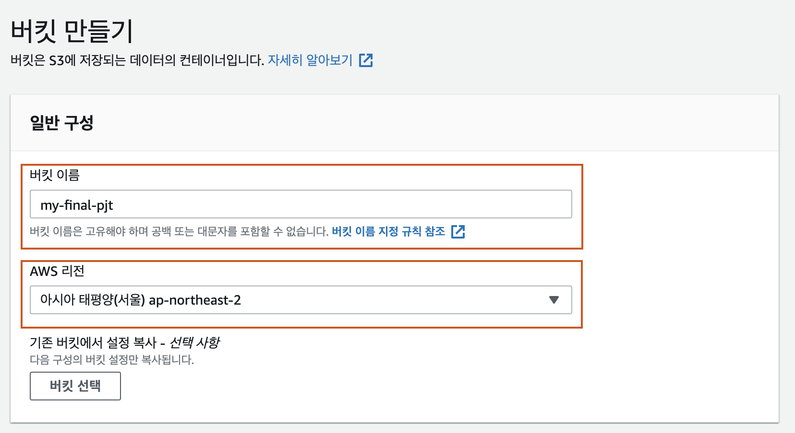
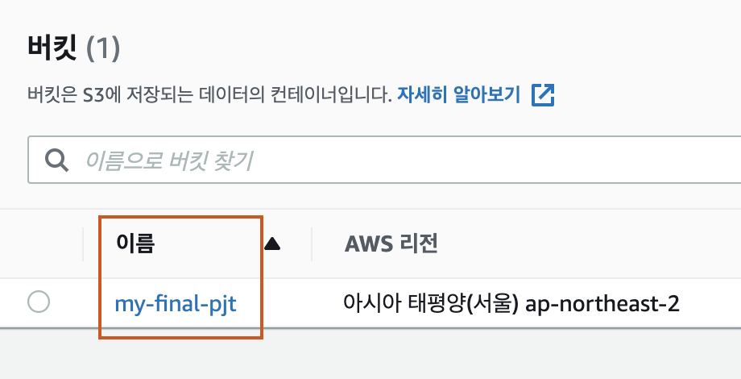
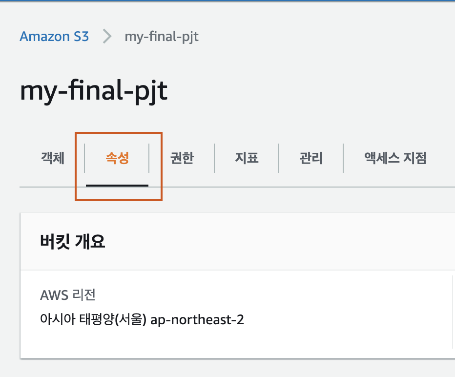
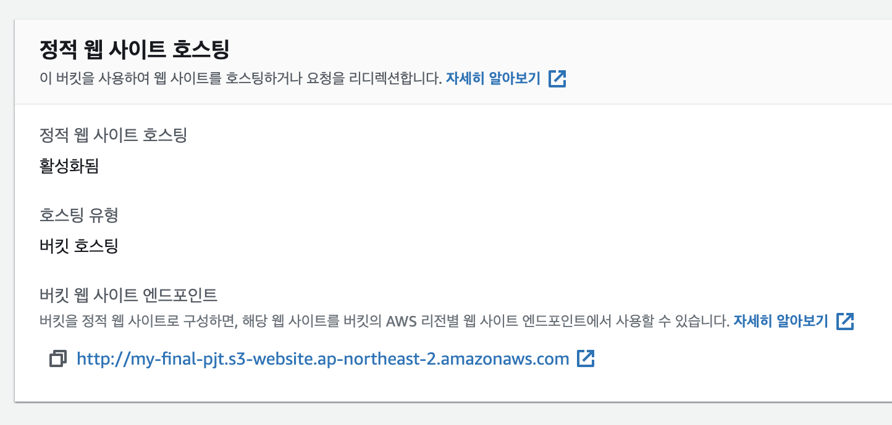
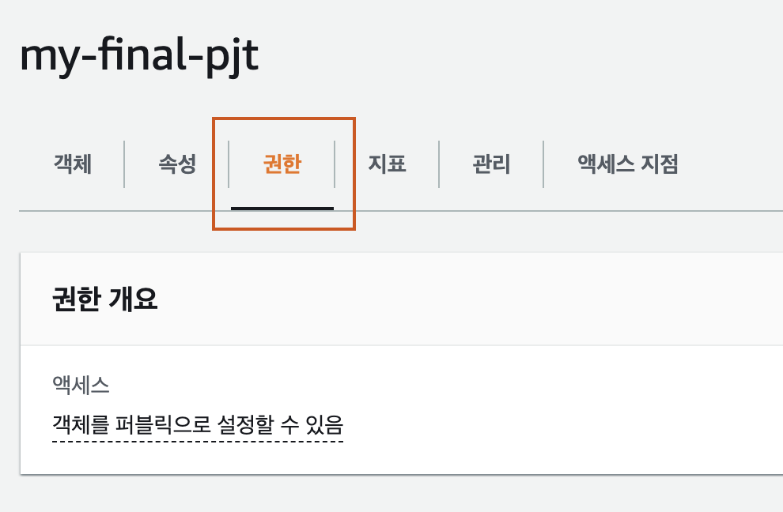
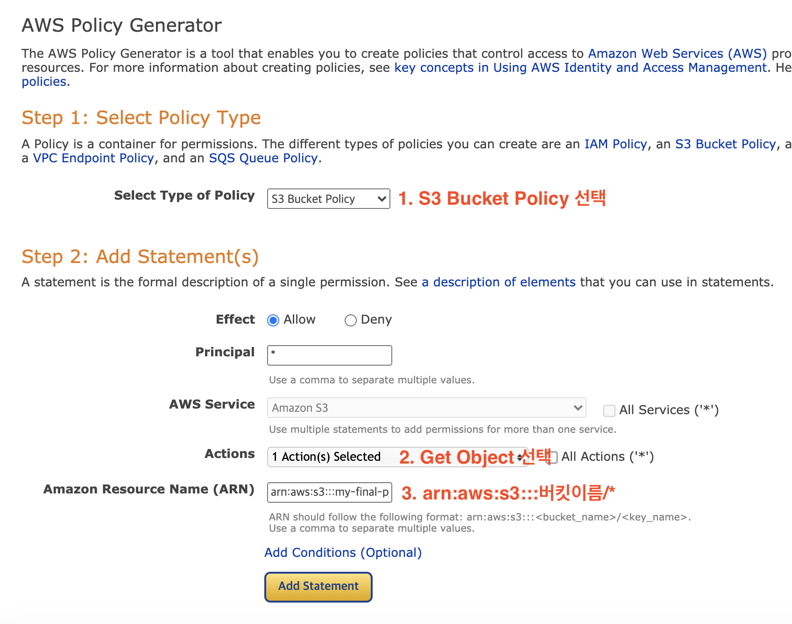
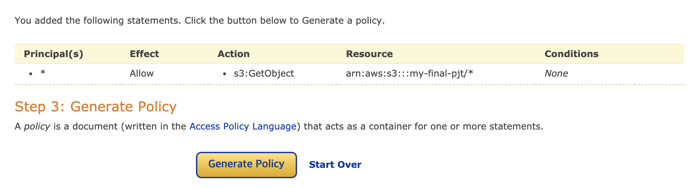
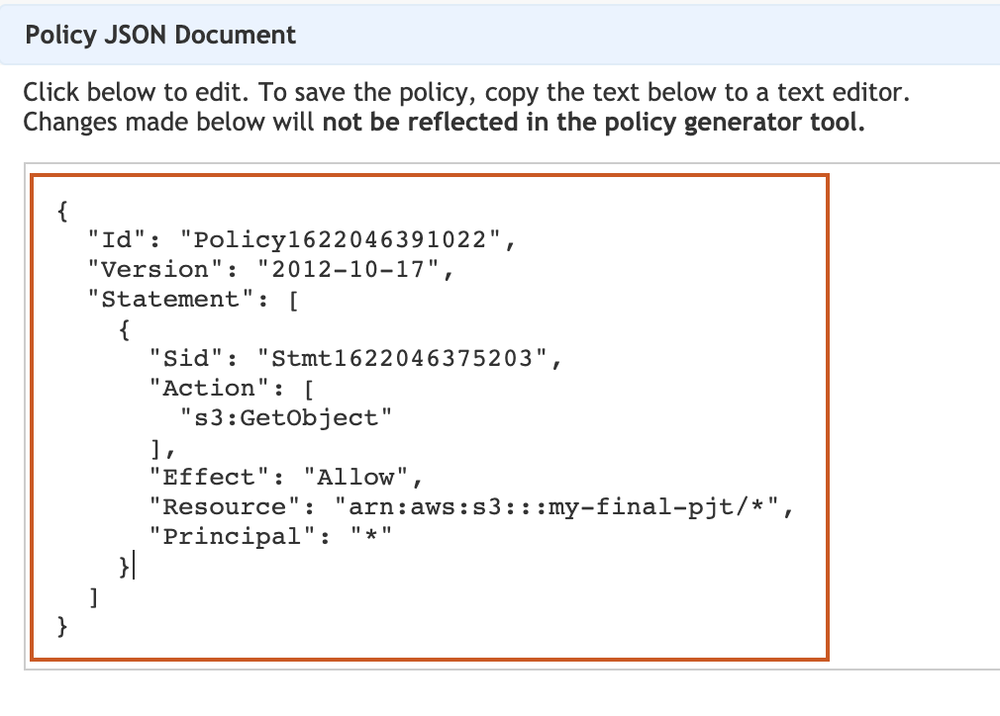
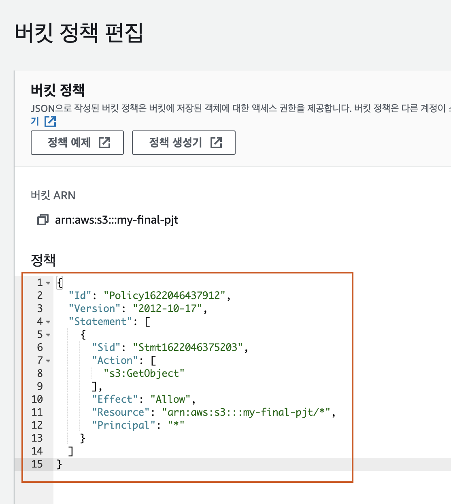

# Deploying Vue on Amazon S3

[toc]

# Local

## Build

- Vue 프로젝트 경로에서 아래 명령어로 dist 폴더 생성

    ```bash
    npm run build
    ```

- dist 폴더 생성 확인

    


# Amazon S3

## 버킷 생성

1. 버킷 만들기 버튼 클릭


2. 버킷 이름 작성 & 리전 선택 (아시아 태평양(서울))



3. (스크롤 내려서) 퍼블릭 액세스 차단 해제 및 동의 버튼 체크


4. 밑으로 내려와서 버킷 만들기 클릭


5. 버킷 생성 확인



## 파일 업로드

1. 버킷명 클릭
    

2. **dist "폴더 안에 있는 파일" 전체 drag & drop으로 업로드**

    > (주의 🚨) dist 폴더 자체가 아닌 **폴더 내부의 파일들**을 올려야합니다.

    

3. 하단 업로드 버튼 클릭

    

4. 업로드 성공 확인 후 우측 종료 버튼 클릭

    

## 정적 호스팅 설정

1. 속성 탭 클릭
    

2. 최하단 정적 웹 사이트 호스팅 섹션에서 편집 클릭

    

3. 활성화 클릭 및 인덱스와 오류 문서에 아래와 같이 기입 (index.html)

    

4. 변경 사항 저장 클릭
5. 정적 웹 사이트 호스팅 섹션 변경 확인
    - 버킷 웹 사이트 엔드포인트 확인 (== Vue 접속 주소)

    

6. 엔드포인트로 접속 후 403 에러 확인

    

## 정책 설정

1. 권한 탭 클릭

    

2. 권한 섹션 내 버킷 정책탭에서 편집 버튼 클릭

    

3. 정책 생성기 버튼 클릭

    

4. 아래 사진의 내용을 참고하여 편집 후 Add Statement 클릭

    

5. 내용 확인 후 Generate Policy 클릭

    

6. 모달 창 내부 JSON 내용 복사 후 창 닫기
    

7. 버킷 정책 편집 창으로 돌아와서 복사한 내용 붙여넣기 후 변경사항 저장
    

8. 브라우저에서 위의 **버킷 엔드포인트 주소**로 접속 후 정상 배포 확인 🚀🚀🚀


# Client-Server 연동

## Server

- CORS whitelist 추가

    ```python
    CORS_ALLOWED_ORIGINS = [
        "S3 버킷 엔드포인트 주소",
    ]
    ```

## Client

- API 요청 주소 수정

    (아래 코드는 예시입니다. 각 프로젝트의 상황에 맞게 바꿔주시면 됩니다.)

    ```js
    const BASE_URL = 'http://배포된_서버_도메인_또는_PUBLIC_IP'
    axios.get(`${BASE_URL}/api/movies/`)
    .then(..)
    .catch(...)
    ```