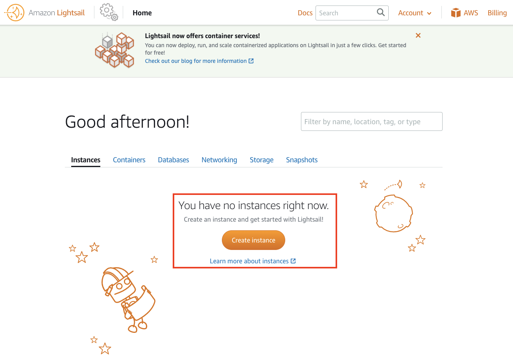
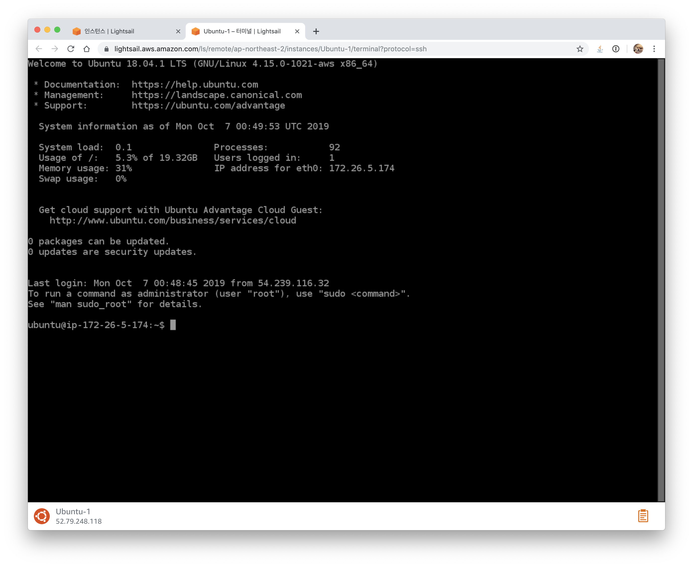
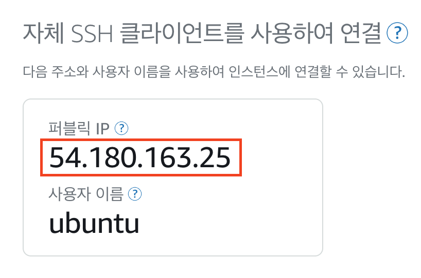

# Deploying Django on AWS Lightsail

[toc]

## 🚨 주의사항 🚨

- 항상 터미널에서의 나의 위치를 확인합니다.

- 가상환경이 활성화되어있는지 확인합니다.

  

## 개발환경

- Python 3.8.x
- Django 3.1.x


## Lightsail 접속 및 인스턴스 생성 클릭




## 인스턴스 이미지 및 OS 선택


## 인스턴스 플랜 및 인스턴스 이름 지정


## 최종 인스턴스 생성


## 인스턴스 생성 확인

잠시 기다리면 Pending ⇒ Running으로 변경.


## 인스턴스 접속





## 배포 전 Django 설정

> 🚨 **잠시 로컬로 돌아와서 Django를 준비시킵니다.**

### requirements.txt

```bash
**(venv) # 반드시 가상환경이 적용되었는지 확인!!**
pip freeze > requirements.txt
```


### settings.py 분리하기

1. `settings` 폴더를 생성합니다.
2. 그 안에 `__init__.py` 파일을 생성합니다.
3. 기존의 `settings.py` 파일을 `base.py`로 변경합니다.
4. `local.py` 그리고 `production.py` 파일을 두 개 생성합니다.

```python
settings/
  __init__.py
  base.py
  local.py
  production.py
```

### base.py

```python
# 기존 settings.py에 있던 모든 내용
```

### local.py

```python
# settings/local.py

from .base import *

DEBUG = True

ALLOWED_HOSTS = []
```

### production.py

- 반드시 ALLOWED_HOSTS에 Lightsail의 퍼블릭 IP를 작성합니다.

```python
from .base import *

DEBUG = False

ALLOWED_HOSTS = [
 # lightsail public_ip 주소
 # ex) 13.126.105.123
]
```

- aws console 에서 배포한 서버 이름 클릭

    

- 퍼블릭 IP 주소 확인

    

### wsgi.py

- **프로젝트폴더명?**
    - `settings` 폴더 및 `wsgi.py`가 있는 폴더를 뜻합니다.

```bash
import os

...

os.environ.setdefault('DJANGO_SETTINGS_MODULE', '프로젝트폴더명.settings.production')

...
```


### manage.py

- **프로젝트폴더명?**
    - `settings` 폴더 및 `wsgi.py`가 있는 폴더를 뜻합니다.

```bash
#!/usr/bin/env python
import os
import sys

if __name__ == '__main__':
    os.environ.setdefault('DJANGO_SETTINGS_MODULE', '프로젝트폴더명.settings.local')
    ...
```


### static 관련 설정

```python
# settings/base.py

STATIC_URL = '/static/'

STATICFILES_DIRS = [ 
	# 직접 만든 static 폴더의 경로를 적습니다.
	# ex1) BASE_DIR / '우리팀_static_폴더명'
  # ex2) BASE_DIR / config / 'static'
]

STATIC_ROOT = BASE_DIR / 'staticfiles'
```

```bash
python manage.py collectstatic
```


## 파이썬 & 필수 패키지 설치

> 🚨 **로컬에서 다시 AWS Lightsail 터미널로 돌아옵니다.**

```bash
sudo apt-get update
sudo apt install gunicorn
sudo apt-get install gcc libpq-dev -y
sudo apt-get install python3-dev python3-pip libpq-dev python3-venv python3-wheel -y
sudo apt-get install nginx
pip3 install wheel
```

```bash
apt list --installed
```


## 프로젝트 Clone

```bash
git clone 프로젝트주소

cd 프로젝트명
```


## 파이썬 가상환경 설정

```bash
python3 -m venv venv
source venv/bin/activate
```


## 필수 패키지 설치

```bash
pip3 install -r requirements.txt
pip3 install wheel
pip3 install gunicorn psycopg2
pip3 freeze > requirements.txt
```


## Gunicorn 설정

- **루트폴더명?** (final-pjt)
    - `manage.py`를 포함하고 있는 폴더를 뜻합니다.
- **프로젝트폴더명?** (config)
    - `settings` 폴더 및 `wsgi.py`가 있는 폴더를 뜻합니다.

```bash
sudo vi /etc/systemd/system/gunicorn.service
```

```bash
# /etc/systemd/system/gunicorn.service

[Unit]
Description=ssafy5 gj final-pjt
After=network.target

[Service]
User=ubuntu
Group=www-data
WorkingDirectory=/home/ubuntu/루트폴더명
ExecStart=/home/ubuntu/루트폴더명/venv/bin/gunicorn --access-logfile - --workers 3 --bind unix:/home/ubuntu/루트폴더명/루트폴더명.sock 프로젝트폴더명.wsgi:application

[Install]
WantedBy=multi-user.target
```

```bash
# /etc/systemd/system/gunicorn.service
# 이곳에서 먼저 작성한 뒤 터미널로 갖고가서 붙여넣으세요!


```


## Gunicorn 실행

- `sudo systemctl status gunicorn` 명령어를 통해 오류가 없는지 확인합니다.
- 아래 명령어 입력 후 `프로젝트명.sock` 파일의 존재 유무를 확인합니다.

```bash
sudo systemctl start gunicorn
sudo systemctl enable gunicorn
sudo systemctl status gunicorn
```


- 에러발생 시 `/etc/systemd/system/gunicorn.service` 파일 수정
- 수정 후 아래 명령어로 재시동

```bash
sudo systemctl daemon-reload
sudo systemctl restart gunicorn
```


## Nginx 설정하기

- **도메인명 또는 lightsail_public_ip?**
    - lightsail에서 제공하는 퍼블릭 IP를 적어주시면 됩니다.
- **루트폴더명?**
    - `manage.py`를 포함하고 있는 폴더를 뜻합니다.

```bash
sudo vi /etc/nginx/sites-available/루트폴더명

ex) sudo vi /etc/nginx/sites-available/final-pjt
```

```bash
# sudo vi /etc/nginx/sites-available/루트폴더명

server {
    listen 80;
    server_name 도메인명_또는_lightsail_public_ip;

		location /static/ {
			alias /home/ubuntu/루트폴더명/staticfiles/;
		}

		location / {
			include proxy_params;
			proxy_pass http://unix:/home/ubuntu/루트폴더명/루트폴더명.sock;
		}
}
```

```bash
# sudo vi /etc/nginx/sites-available/루트폴더명
# 이곳에서 먼저 작성한 뒤 터미널로 갖고가서 붙여넣으세요!


```

```bash
sudo ln -s /etc/nginx/sites-available/루트폴더명 /etc/nginx/sites-enabled
```

```bash
# sudo ln -s /etc/nginx/sites-available/루트폴더명 /etc/nginx/sites-enabled
# 이곳에서 먼저 작성한 뒤 터미널로 갖고가서 붙여넣으세요!

```


## Nginx 동작 확인 및 재실행

```bash
sudo nginx -t
```

```bash
sudo systemctl restart nginx
```


## Nginx 에러발생 시 수정 후 전체 재실행

```bash
sudo systemctl daemon-reload
sudo systemctl restart gunicorn
sudo systemctl restart nginx
```

